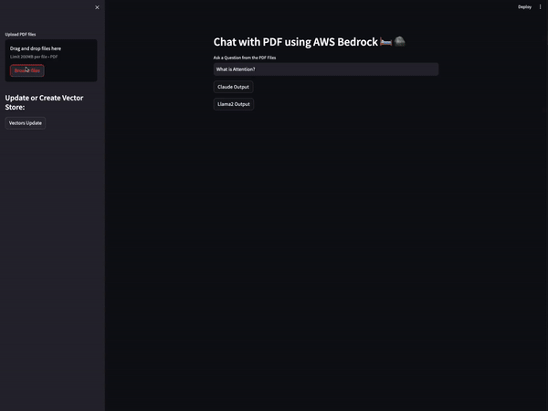

# Chat with PDF using AWS Bedrock 🛏️ 🪨



This application leverages AWS Bedrock, FAISS for vector storage, and various language models to enable querying PDF documents in a conversational manner. It uses Streamlit for the frontend, providing an interactive web app where users can upload PDF files, generate embeddings, and ask questions based on the content of these documents.

## Features

- **PDF Processing**: Upload and process PDF documents to extract text.
- **Embeddings Generation**: Generate vector embeddings for the extracted text using AWS Bedrock's Titan Embeddings Model.
- **Interactive Querying**: Use language models like Claude and Llama2 for answering questions based on the processed PDFs.
- **Vector Storage**: Store and retrieve vector embeddings using FAISS.

## Prerequisites

Before you begin, ensure you have met the following requirements:

- AWS Account and AWS CLI configured with access to Bedrock Runtime.

## Installation

Clone the repository to your local machine:

```bash
git clone https://github.com/canberk17/chat_with_pdf.git
```

## Navigate into the project directory:

```bash
cd chat_with_pdf
```

## Install the required dependencies:

```bash
pip install -r requirements.txt
```

## Usage

To start the application, run the following command in your terminal:

```bash
streamlit run app.py
```

## Uploading PDFs

- Use the Streamlit interface to upload one or more PDF documents.
- The application will process these documents, creating embeddings that can be queried.

## Asking Questions

- Type your question into the Streamlit text input box.
- Choose the model you wish to use for generating the response (Claude or Llama2).
- The application will retrieve relevant information from the processed PDFs to answer your question.
